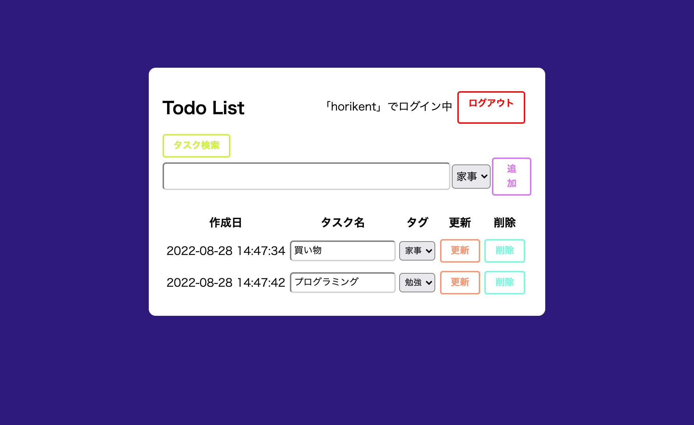
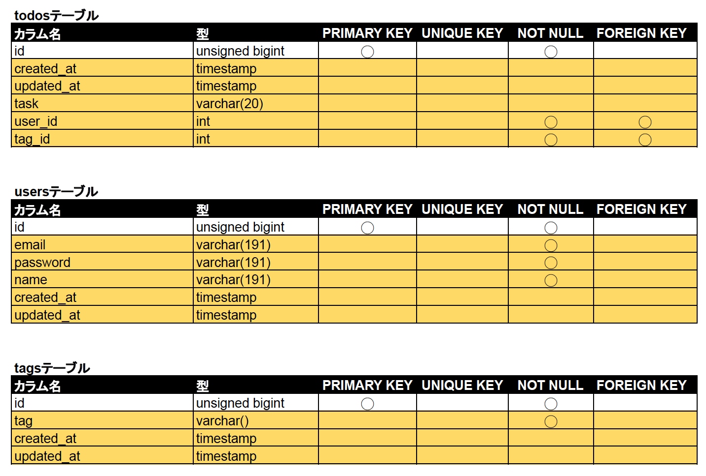
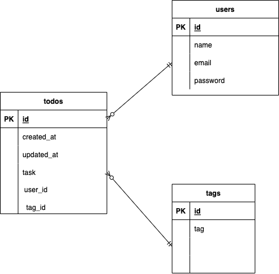

# アプリケーション名
Todo List

## 作成した目的
アプリを用いたTodolistの管理。
アプリ制作を通じてLaravelの学習。

## 機能一覧
Todoの一覧・追加・更新・削除
ユーザー認証（ログイン、サインアップ、ログアウト）
タグ機能(追加機能なし)
デフォルトタグ：家事、勉強、運動、食事、移動
検索機能（タスク名・タグの一部一致）

## 使用技術（実行環境）
PHP8.1.8 
Laravel9

## テーブル設計

 

## ER 図

 

## 他に記載することがあれば記述する

